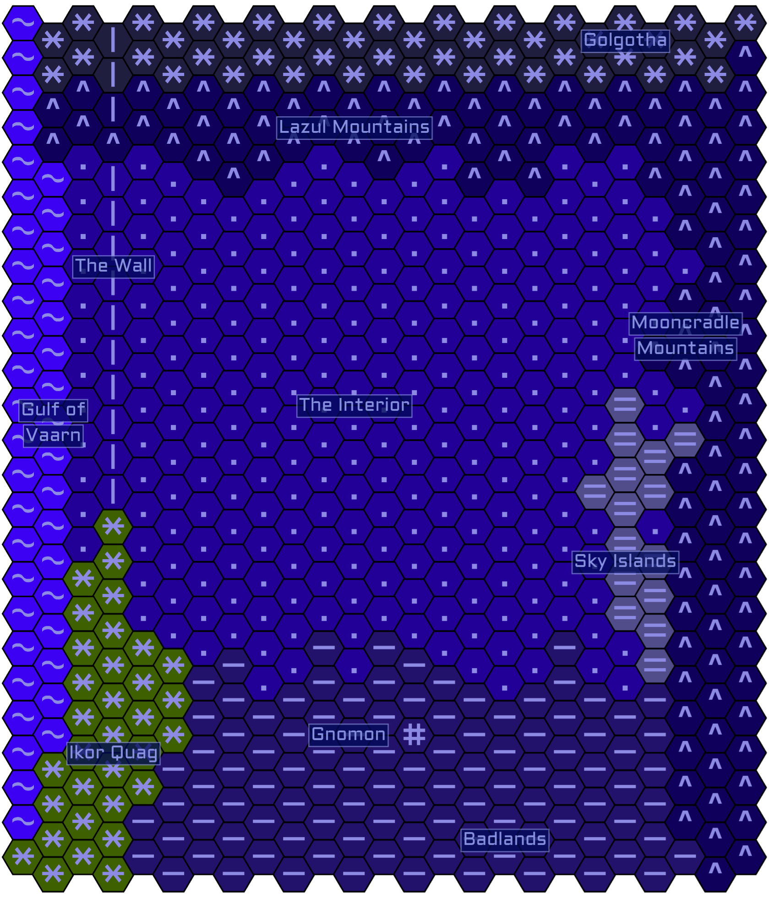
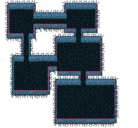

# Vaarn Tilesets

This repository has two goals, the first is to provide a toolset for creating stylistically consistant overworld and dungeon maps for Vaults of Vaarn. The second is that the tiles and map templates within are a collaborative effort by anyone that finds value in this project.

Here is what is included so far:

- Hexagon tileset and ASCII glyph stamps for hex maps
- 8x8 pixel grid tileset for dungeon maps
- A Vaarn inspired color palette
- Example maps for editing
- Instructions on how to create maps
- Instructions on how you can contribute

# How to Use This Repository?

I have spent a lot of time locating free tools to use, as well as keep things as simple as possible but by no means must you use any of the tools I recommend. In fact I encourage feedback to improvements to this document, tile submissions either by pull request, or direct communication are also welcome including tileset contributions that are compatable your mapping tool of choice. 

# Tilesets

In this section I will quickly discuss which tools I am using to make the map templates.

### Hex Kit

[Hex Kit](https://coneofnegativeenergy.com/hex-kit/) is the only tool so far on this list that costs money ($15), but in my opinion it is very worth it because of its low cost, ease of use, and good enough image exports. It also has a mode that allows it to be used at the table with referee, and player facing maps, the latter having a fog of war.

### LDtk

[LDtk](https://ldtk.io/) (Level Designer Toolkit) is a free and open source map creation tool aimed at 2d side scroller, and top-down indy video game creators. It uses tiles as its primary method of creating a map, but also supports using plain colors with stamps. LDtk has a very powerful, yet easy to use rule system that makes creating maps very fast, and with a consistant look.

## Hex Tiles

The hex tiles in this repository were designed for use with hex kit and have a flat top. They were inspired by the [Regions of Vaarn](https://vaultsofvaarn.com/2020/07/14/regions-of-vaarn/) post on the Vaults of Vaarn blog.

### Creating an Overland Map

Coming soon

## Grid Tiles

The grid tiles are 8x8 pixel designs in a single image file and are designed to resemble roguelike games. 

 

### Making a Dungeon Map

The power of the grid tileset comes when combining the tiles with a tool like LDtk. LDtk has a rule system called [auto layers](https://ldtk.io/docs/tutorials/auto-layers/) that will automatically apply additional layers of tiles as you draw. For example, you can have a rule for when you draw the floor, the walls will be automatically drawn. You can add variety to these rules by selecting multiple tiles in the rule editor, LDtk will randomize which tile is placed frm the stack.

## Making new tiles

In this section I will quickly discuss the tools I am using for creating the tiles in this set.

### Gimp

I have been using [GIMP](https://www.gimp.org/) to create the hex tiles, and I have all of the tile colors, borders, and glyphs in individual layers for easy combinations for export to png. This project file can be found in the `src` directory.

### Libresprite

For the grid tiles, I have been using [libresprite](https://libresprite.github.io/#!/) a free and open source fork of [Aseprite](https://www.aseprite.org/). Either one of those tools will work, and are far superior to using a tool such as Gimp when working on 8x8 pixel tilesets. There are other pixel editors out there, so if you already have a favorite editor, I am sure it will work fine as well. I do not have a project file with layers for the tilesets, instead edit the `tilesets/grid/vaarn-8x8.png` tileset directly.

### PureRef

This is an optional tool, but I have been really enjoying [PureRef](https://www.pureref.com/) for creating Mood Boards, or even just having a single image open for reference while working.

Here are a few example use cases:
- Reference another digital map as a reference while drawing your map.
- Reference a digital image while drawing a POI hex stamp.
- Reference screenshots of vintage games while designing new grid tiles.
- Keeping a visual reference of items to stock in the dungeon you are drawing.

### Color Palette

The GIMP color palette `color-palette/vaarn-color-palette.gpl` is supported by  both GIMP and Libresprite, and should be used if designing new tiles to keep with a consistent color scheme. [Here](https://www.lifewire.com/import-a-color-palette-into-gimp-1701682) is a link on how to import it into GIMP, and [here](https://techstacker.com/import-any-palette-aseprite/) is one for Libresprite.

# Contributing

Contributions to this project are welcome, and I will share as much as I can here to make that a smooth process if you choose to do so.
